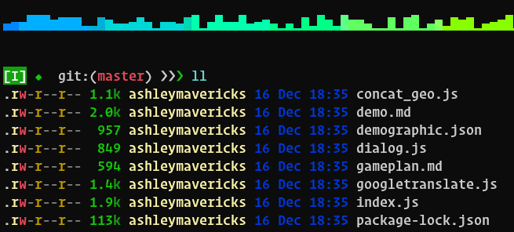

# Anurag Singh's dotfiles
Dotfiles are the customization files that are used to personalize your Linux or other Unix-based system.  You can tell that a file is a dotfile because the name of the file will begin with a period–a dot!

## Contents

- fish config
- zsh config

## Fish Shell setup (macOS & Linux)

- [Fish shell](https://fishshell.com/)
- [Fisher](https://github.com/jorgebucaran/fisher) - Plugin manager
- [Sashimi](https://github.com/isacikgoz/sashimi) - A minimal fish shell prompt made of raw fish.
- [z for fish](https://github.com/jethrokuan/z) - Directory jumping
- [Exa](https://the.exa.website/) - `ls` replacement
- [ghq](https://github.com/x-motemen/ghq) - Local Git repository organizer
- [peco](https://github.com/peco/peco) - Interactive filtering
